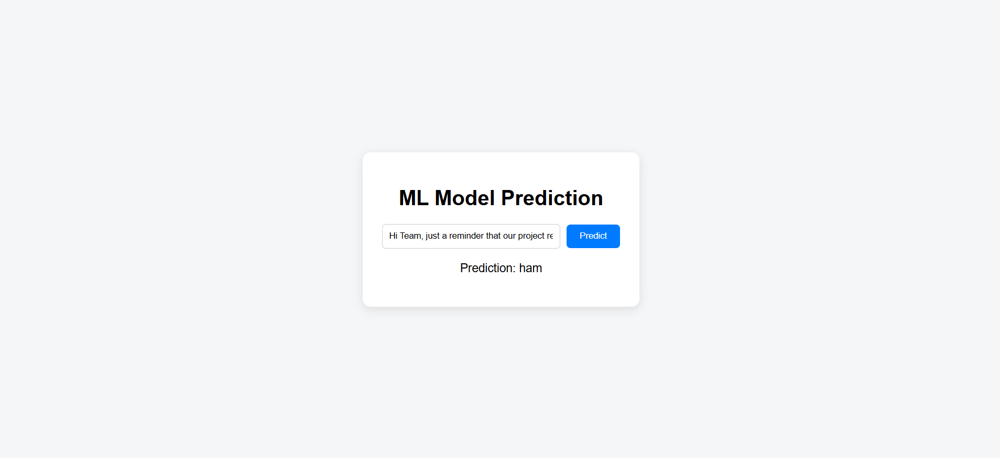

# 📧 Spam Mail Detector

A Machine Learning based **Spam Mail Detection System** that classifies emails as **Spam** or **Not Spam (Ham)**.  
This project uses Natural Language Processing (NLP) techniques and a trained ML model to analyze text and detect spam messages effectively.

---

## 🚀 Features
- Classifies emails into **Spam** and **Ham**.
- Built with **Python, scikit-learn, and Flask/React**.
- Uses **TF-IDF Vectorizer** and a trained classification model.
- Simple **web interface** for predictions.
- Supports real-time detection.

---

## 📂 Project Structure
spam_detector/
│── backend/
│ ├── app.py # Flask backend
│ ├── job_predictor.py # ML prediction logic
│ ├── requirements.txt/
│
│── frontend/
│ ├── src/
│ │ ├── App.js # React frontend
│ │ ├── Home.js # Home page
│ │ ├── App.css # Styling
│ │ └── assets/ # Logo/images
│ ├── public/
│ │ └── index.html
│
│── README.md # Project documentation

2️⃣ Setup backend (Flask + ML)
cd backend
pip install -r requirements.txt
python app.py

3️⃣ Setup frontend (React)
cd frontend
npm install
npm start

📊 Model Training

    Load dataset (e.g., spam.csv).
    Preprocess text (lowercasing, removing stopwords, punctuation).
    Vectorize using TF-IDF.
    Train ML models like:
        Naive Bayes
        Logistic Regression
        SVM
    Save the best model (.pkl) and vectorizer.

📸 Screenshots
    
🙌 Contributing

    Pull requests are welcome. For major changes, please open an issue first to discuss what you’d like to change.

👨‍💻 Author

    [Sk SAKLINE MUSTAQUE]

    GitHub: @Sakku4590

    Email: saklinemustaque3@gmail.com

